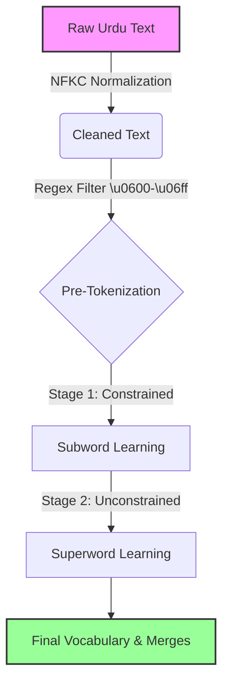

# 🇵🇰 Urdu-TwoStage-BPE: Optimized Script-Aware Tokenizer

[](https://www.python.org/)
[](https://en.wikipedia.org/wiki/Natural_language_processing)
[](LICENSE)

> **A Script-Aware Two-Stage Tokenizer specifically adapted for the Urdu Nastaʿlīq script, achieving a 7.08% reduction in token fertility compared to standard BPE.**

---

## 📖 Overview

Standard Large Language Models (LLMs) like GPT-4 often struggle with low-resource languages like Urdu. Because their tokenizers are optimized for English, they fragment Urdu words into meaningless byte sequences. This results in high **Fertility Scores** (more tokens per word), leading to slower inference and higher API costs.

**Urdu-TwoStage-BPE** addresses this "tokenization bottleneck" by implementing a custom pipeline inspired by the *IndicSuperTokenizer (2025)* methodology. It uses a **Two-Stage Training** approach to learn linguistically valid subwords followed by efficient "superwords."

---

## 🚀 Key Features

* **⚡ Two-Stage Training Algorithm:**
    * **Stage 1 (80%):** Constrained learning of morphological subwords (roots, prefixes).
    * **Stage 2 (20%):** Unconstrained learning of "Superwords" (frequent phrase merging).
* **🛠️ Urdu-Specific Pre-Tokenization:**
    * Custom Regex pattern `\p{Arabic}` to respect Nastaʿlīq script boundaries.
    * Prevents incorrect merging of Urdu words with numbers or punctuation.
* **🧹 Robust Cleaning Pipeline:**
    * NFKC Normalization to standardize unicode characters.
    * Noise filtering to remove non-Urdu artifacts.
* **📊 Proven Efficiency:**
    * Reduced Fertility Score from **1.50** to **1.40** on the Urdu News Dataset.

---

## 🏗️ Architecture & Methodology

Our pipeline ensures that the tokenizer learns from clean, linguistically accurate data boundaries.


### The Regex Guard
We use a strict regex pattern to strictly separate Urdu text from numbers and symbols before training begins:

```python
# Captures Urdu words, Numbers, and Punctuation separately
regex_pattern = r""" ?\p{Arabic}+| ?\p{N}+| ?[^\s\p{Arabic}\p{N}]+|\s+"""
```
## 📊 Results

We evaluated the tokenizer on an unseen Validation Set of Urdu News Headlines. The primary metric is **Fertility Score** (Lower is Better).

| Model Configuration | Subword Split | Superword Split | Fertility Score | Improvement |
| :--- | :---: | :---: | :---: | :---: |
| **Baseline (Standard BPE)** | 100% | 0% | 1.5082 | - |
| **Proposed (IST Urdu)** | **80%** | **20%** | **1.4014** | **+7.08%** 🚀 |

> *A 7% improvement means an LLM can process ~300 more words of Urdu context within the same window limit.*

---

## 📂 Repository Structure

```bash
├── Urdu_TwoStage_Tokenizer.ipynb   # Complete implementation code (Training & Eval)
├── Urdu_Tokenizer_Report.pdf       # IEEE formatted project report
└── README.md                       # Project documentation
```
## 💻 Quick Start

### 1. Installation
You will need `regex` and `pandas` installed:

```bash
pip install regex pandas
```

### 2. Usage
```python
from tokenizer import TwoStageUrduTokenizer

# Initialize
tokenizer = TwoStageUrduTokenizer()

# Train on your corpus
corpus = "پاکستان کرکٹ ٹیم نے شاندار کارکردگی کا مظاہرہ کیا۔"
tokenizer.train(corpus, vocab_size=2000, transition_pct=0.8)

# Encode text
text = "وزیراعظم پاکستان"
tokens = tokenizer.encode(text)

print(f"Tokens: {tokens}")
# Output: Efficient tokens thanks to Superword merging!
```
## 📜 References & Credits

This project is an adaptation of the methodology proposed in:

* **IndicSuperTokenizer: An Optimized Tokenizer for Indic Multilingual LLMs (2025).**

**Collaborators:**
* **Mustafa Waqar** ([@MusW02](https://github.com/MusW02))
* **Bilal Asif Burney** ([@BilalAsifB](https://github.com/BilalAsifB))
* **M Sheharyar** ([@sheharyar1411](https://github.com/sheharyar1411))
* **Arman Faisal** ([@Arman-dev123](https://github.com/Arman-dev123)
